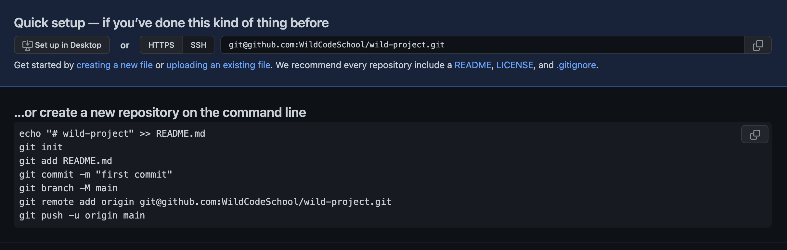

# Special guests: Tic et Tac

[⬅ English version](./)

En équipe de 2, suivez les instructions, chaque personne choisissant son rôle !
Colonne de gauche : Tic. Colonne de droite : Tac.
Dans cet atelier, vous apprendrez comment collaborer à l'aide de Git et GitHub, comment gérer les conflits de fichiers et comment versionner votre code.

## Tic

Crée un nouveau répertoire vide nommé `wild-project` sur votre poste de travail.
Crée un nouveau repository public vide sur GitHub appelé `wild-project` sur votre profil. (Pas de génération de README.md !!)

## Tac

Regarde ce que fait Tic et sois attentif.

## Tic

Dans le nouveau dossier `wild-project` situé localement sur ton ordinateur,
suis les commandes répertoriées sur GitHub dans **...or create a new repository on the command line**.

Assure-toi d'avoir coché l'option SSH, pas HTTPS.
{: .alert-warning}

## Tac

Explique à Tic ce qu'il fait à chaque étape.

# Ces commandes



## Tic

Donne le lien vers le repo à Tac et comprenez ensemble comment le cloner sur son ordinateur.

## Tac

Clone le repo nouvellement créé de Tic en renommant le répertoire cible local "wild-tac".<br>Attention, utilise :

```bash
git clone url_of_the_new_repository wild-tac
```

# Tout le monde

Ouvrez le répertoire du projet dans votre éditeur de code.
{: .alert-info}

## Tic

Modifie le fichier README.md en tapant :

```bash
# wild-project

Comment installer ce projet ?

Tout ce que nous avons à faire pour l'instant, c'est de le cloner.
```

## Tac

Regarde ce que fait Tic et sois attentif.

## Tic

Crée le fichier `another_file.html` dans le répertoire du projet.<br>
Ajoute un commentaire à l'intérieur du fichier :

```html
<!-- tapez votre commentaire ici -->
```

## Tac

Crée le fichier `not_same_file.html` dans le dossier du projet.<br>
Ouvre le fichier et ajoute également un commentaire à l'intérieur, peu importe qu'il soit identique ou différent.

## Tic

Regarde ce que fait Tac, essaye de comprendre ce qui se passe à chaque étape et quel est le résultat.

## Tac

Crée le fichier `secret_file.html` contenant :

```html
<!-- Ne doit pas être partagé sur GitHub car c'est le mot de passe que j'utilise
pour gmail, Facebook, mon ordinateur portable, et si je le pouvais,
je l'utiliserais pour le code PIN de mon téléphone -->
```

Exécute :

```bash
git status
```

<!-- thx https://css-tricks.com/targetblank/ -->

Ignore le fichier `secret_file.html` en créant un fichier `.gitignore` (<a href="https://git-scm.com/docs/gitignore" target="git-documentation">clique ici</a> pour plus d'informations) et en ajoutant les instructions nécessaires.

## Tic

Exécute :

```bash
git status
```

## Tac

Exécute :

```bash
git status
```

Le fichier `.gitignore` devrait apparaître.

# Tout le monde

```bash
git add .
git status
git commit -m "Change me"
```

Remplacez `"Change me"` par un message explicite expliquant ce que vous avez fait. Il n'y a pas de limites, et vous pouvez appuyer sur Entrée tant que vous n'avez pas fermé les guillemets.
{: .alert-info}

## Tic

Commence par pousser :

```bash
git push
```

## Tac

Pareil pour toi, **après Tic** :

```bash
git push
```

## Tic

Tout s'est bien passé pour toi.

## Tac

Tu as un message d'erreur : que dit le message ?

## Tic

Puisque tu es propriétaire du dépôt, tu dois autoriser Tac à travailler dessus...<br>
Accéde à “Settings” > “Collaborators and team” et ajoute Tac en tant que collaborateur.

## Tac

Tu dois accepter l'invitation que tu as dû recevoir dans ta boîte mail. Essaye ensuite à nouveau de transférer ton commit vers le repo en ligne :

```bash
git push
```

## Tic

En tant que "Ranger du risque", aide Tac.

## Tac

Tu as un autre message d'erreur ! Que dit le message ?<br>
Trouve la solution sans chercher sur Internet, simplement en lisant le message dans la console.<br>

Si tu es vraiment bloqué, appelle ton formateur ou ta formatrice pour obtenir de l'aide !
{: .alert-info}

Une fois le problème résolu, tu peux enfin pousser :

```bash
git push
```

# Ensemble

Vérifiez la mise à jour sur GitHub. Le fichier `secret_file.html` est-il là ?
{: .alert-info}

## Tic

Fais un `git pull` pour obtenir les dernières modifications apportées par Tac. <br>
Crée ensuite une nouvelle branche à partir de la branche actuelle :

```bash
git branch tic_branch
git switch tic_branch
```

Ou directement :

```bash
git switch -c tic_branch
```

## Tac

Suis les mêmes instructions que Tic et créez une nouvelle branche `tac_branch`.

## Tic

Crée un fichier `same_file.html` et saisis un commentaire :

```html
<!-- tapez votre commentaire ici -->
```

## Tac

Crée un fichier `same_file.html`` et tape également un commentaire à l'intérieur, mais pas le même que Tic !

# Tout le monde

```bash
git add .
git status
git commit -m "Change me"
```

## Tic

Publie ta branche sur GitHub en utilisant :

```bash
git push origin tic_branch
```

## Tac

Publie ta branche sur GitHub en utilisant :

```bash
git push origin tac_branch
```

## Tic

Crée une pull request sur GitHub depuis ta branche `tic_branch` vers `main` (sois prudent avec la direction).

Vérifie si “able to merge” s'affiche.
Ajoute une description : “Explain what you modified and how to test it”.

## Tac

Regarde ce que fait Tic et fais de même avec ta branche (`tac_branch` vers `main`)

## Tic

Regarde ce que fait Tac et aide-le si nécessaire.

## Tac

Va sur GitHub et accéde à ta pull request.<br>
Vérifie si tout semble bon, puis clique sur le bouton “Merge pull request”.

🥳 Bon travail ! Tu viens de réussir la fusion de ta première branche ! Maintenant, tu peux voir ton travail sur la branche principale.
{: .alert-info}

## Tic

Suis les mêmes étapes que Tac pour valider ta pull request et pouvoir fusionner ta branche.

Fichtre ! Il y a un conflit ! tu peux voir le message : “This branch has conflicts that must be resolved”.
{: .alert-warning}

## Tac

Regarde ce que fait Tic.

# Regardez ça ensemble

<iframe width="560" height="315" style="display:block; margin:auto" src="https://www.youtube.com/embed/JtIX3HJKwfo" allow="accelerometer; autoplay; encrypted-media; gyroscope; picture-in-picture" allowfullscreen></iframe>

## Tic

Au lieu de résoudre les conflits sur GitHub comme indiqué dans la vidéo, fais-le localement dans ton éditeur de code.

Sur GitHub, clique sur "command line instructions" comme indiqué dans l'image suivante et suis les instructions. N'oublie pas de faire un `git status` entre chaque étape et d'en discuter avec Tac.


## Tac

Regarde ce que fait Tic et aide-le si besoin (une deuxième personne ne sera pas toujours là pour résoudre les conflits avec vous, alors profitez-en !)

## Tic

Maintenant qu’il n’y a plus de conflits, reviens à la pull request sur GitHub, vérifie si tout va bien et clique sur le bouton `Merge pull request`.

## Tac

Regarde ce que fait Tic et aide si nécessaire.

# Ensemble

Vous avez résolu avec succès un conflit de fusion dans une pull request, félicitations ! 🥳
{: .alert-info}
