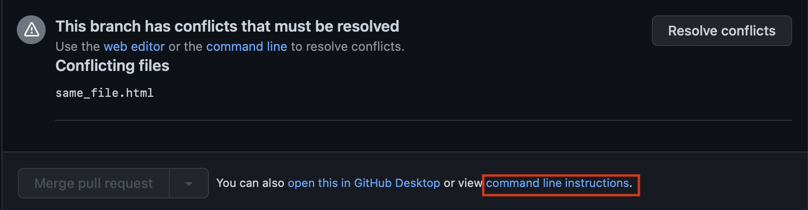

# Special guests: Chip and Dale

[⬅ Version FR](./README-FR)

In a team of 2 developers, follow the instructions, each choosing their role!
Left column: Chip. Right column: Dale.
In this workshop, you will learn how to collaborate using Git and GitHub, how to manage file conflicts, and how to version your code.

## Chip

Create a new empty directory named `wild-project` on your workstation.
Create a new empty public repository on GitHub called `wild-project` on your profile. (No README.md generation!!)

## Dale

Watch what Chip does and pay attention.

## Chip

Inside the new folder `wild-project` located locally on your computer,
follow the commands listed on GitHub in **...or create a new repository on the command line**.

Be sure you checked SSH option, not HTTPS.
{: .alert-warning}

## Dale

Explain to Chip what he is doing in each step.

# These commands


## Chip

Give the link to the repository to Dale, and understand how to do clone it together on Dale's computer.

## Dale

Clone Chip's newly created repository by renaming the local target directory "wild-dale".<br>Be careful, use :

```bash
git clone url_of_the_new_repository wild-dale
```

# Everyone

Open the project directory in your Code Editor.
{: .alert-info}

## Chip

Modify the README.md file by typing:

```markdown
# wild-project

How to install this project?

All we have to do for now is clone it.
```

## Dale

Watch what Chip does and pay attention.

## Chip

Create the file `another_file.html` in the project directory.<br>
Add a comment inside the file:

```html
<!-- type your comment here -->
```

## Dale

Create the file `not_same_file.html` in the project folder.<br>
Open the file and add a comment inside as well, it doesn't matter if it's the same or different.

## Chip

Look at what Dale is doing, try to understand what is happening in each step and what the result is.

## Dale

Create the file `secret_file.html` containing:

```html
<!-- Must not be shared on GitHub because this is the password I use for gmail,
facebook, my laptop, and if I could, I would use the same as pin for my cell
phone -->
```

Execute:

```bash
git status
```

<!-- thx https://css-tricks.com/targetblank/ -->

Ignore the file `secret_file.html` by creating a `.gitignore` file (<a href="https://git-scm.com/docs/gitignore" target="git-documentation">click here</a> for more information) and adding the necessary instructions to it.

## Chip

Execute:

```bash
git status
```

## Dale

Execute:

```bash
git status
```

The `.gitignore` file should appear.

# Everyone

```bash
git add .
git status
git commit -m "Change me"
```

Replace `"Change me"` by an explicit message explaining what you've done, there are no limits, and you can press enter as long as you haven't closed the quotes.
{: .alert-info}

## Chip

Start pushing first:

```bash
git push
```

## Dale

Same for you, **after Chip**:

```bash
git push
```

## Chip

Everything went well for you.

## Dale

You've got an error message: what does the message say?

## Chip

Since you're the owner of the repository, you have to allow Dale to work on it...<br>
Navigate to “Settings” > “Collaborators and team” and add Dale as a collaborator.

## Dale

You have to accept the invitation you should have received is in your mailbox. Then try again to push your commit to the online repository:

```bash
git push
```

## Chip

As "Risk Ranger", help Dale.

## Dale

You've got another error message! What does the message say?<br>
Find the solution without searching the internet, just by reading the message in the console.<br>

If you're really stuck, call your trainer for help!
{: .alert-info}

Once you fixed the problem, you can finally push:

```bash
git push
```

# Together

Check the update on GitHub. The `secret_file.html` file: is it there?
{: .alert-info}

## Chip

Do a `git pull` to get last changes made by Dale. <br>
Then create a new branch from the current one:

```bash
git branch chip_branch
git switch chip_branch
```

Or directly:

```bash
git switch -c chip_branch
```

## Dale

Follow the same instructions as Chip, and create a new branch `dale_branch`.

## Chip

Create a `same_file.html` file and type a comment, i.e.:

```html
<!-- type your comment here -->
```

## Dale

Create a `same_file.html`` file and also type a comment inside it, but not the same as Chip!

# Everyone

```bash
git add .
git status
git commit -m "Change me"
```

## Chip

Publish your branch on GitHub using:

```bash
git push origin chip_branch
```

## Dale

Publish your branch on GitHub using:

```bash
git push origin dale_branch
```

## Chip

Create a pull request on GitHub from your branch `chip_branch` to `main` (Be careful with the direction).

Check if “able to merge” is displayed.
Add a description: “Explain what you modified and how to test it”.

## Dale

Watch what Chip is doing, and do the same with your branch (`dale_branch` to `main`)

## Chip

Look at what Dale is doing and help him if needed.

## Dale

Go on GitHub and go to your pull request.<br>
Check if everything looks good and then click on the “Merge pull request” button.

🥳 Good Job ! You just successfully merge your first branch ! Now, you can see your work on the main branch.
{: .alert-info}

## Chip

Follow the same steps as Dale to validate your pull request and be able to merge your branch.

Damn ! There is a conflict ! You can see the message : “This branch has conflicts that must be resolved”.
{: .alert-warning}

## Dale

Look at what Chip does.

# Watch this together

<iframe width="560" height="315" style="display:block; margin:auto" src="https://www.youtube.com/embed/JtIX3HJKwfo" allow="accelerometer; autoplay; encrypted-media; gyroscope; picture-in-picture" allowfullscreen></iframe>

## Chip

Instead of resolving the conflicts on GitHub like it is shown in the video, do it locally in your code editor.

On GitHub click on "command line instructions" as shown in the next image and follow the instructions. Don't forget to do some `git status` between every step and discuss about it with Dale.



## Dale

Look at what Chip is doing and help if needed (A second developper won't always be here to resolve the conflicts with you, so take the benefit of it !)

## Chip

Now that there is no more conflicts, go back to the pull request on GitHub, check if everything is good and click on the “Merge pull request” button.

## Dale

Watch what Chip does and help if needed.

# Together

You successfully resolved a merge conflict in a pull request, congratulations! 🥳
{: .alert-info}
